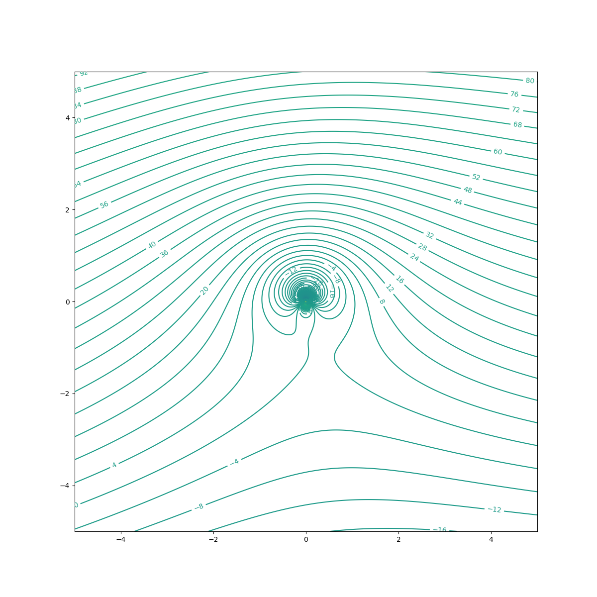
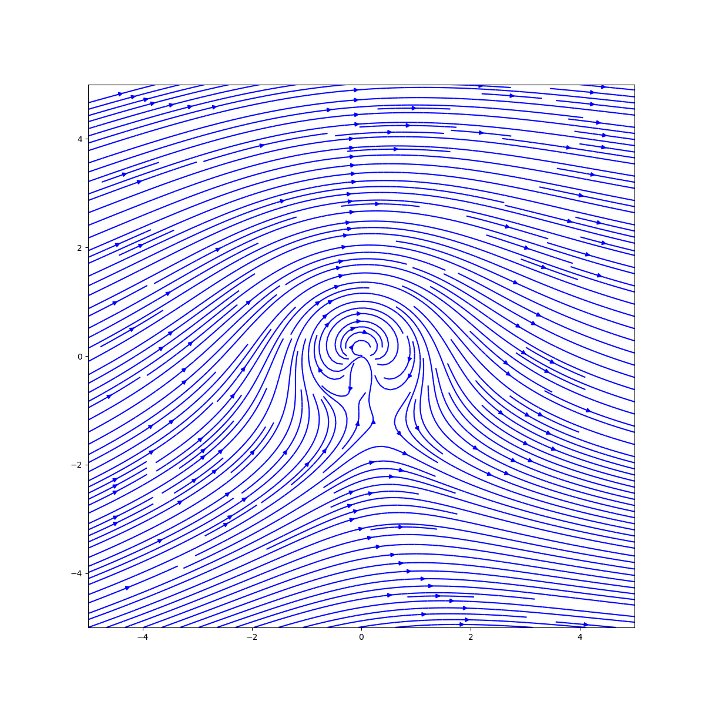
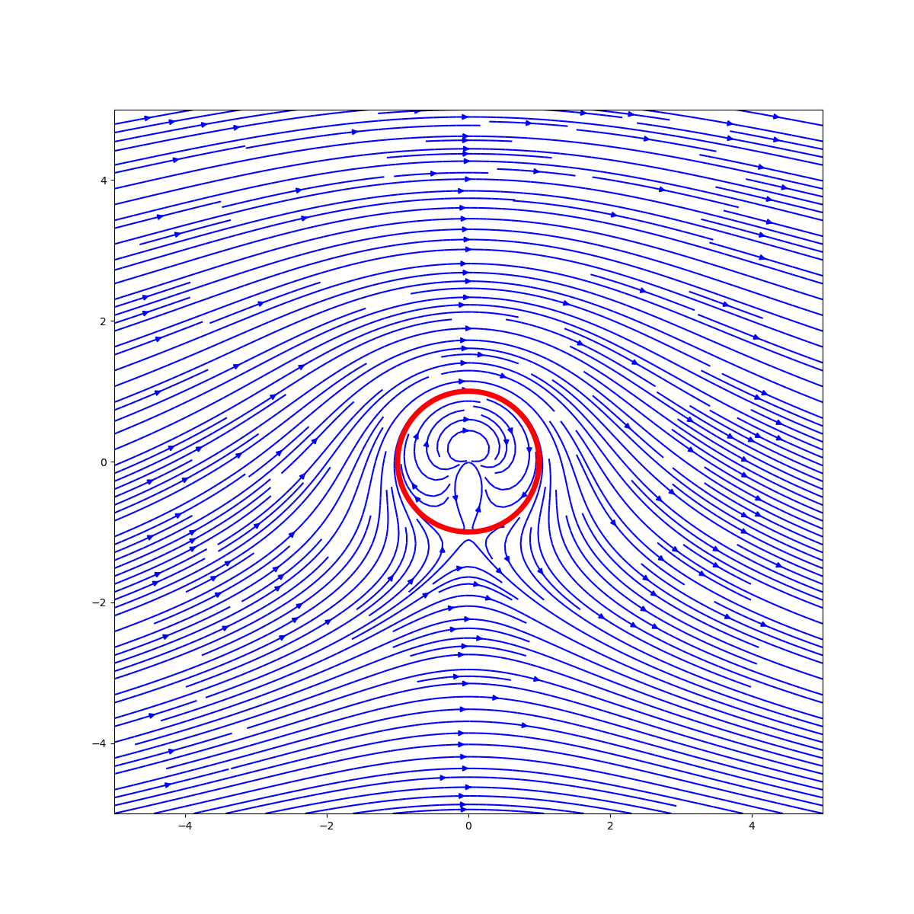
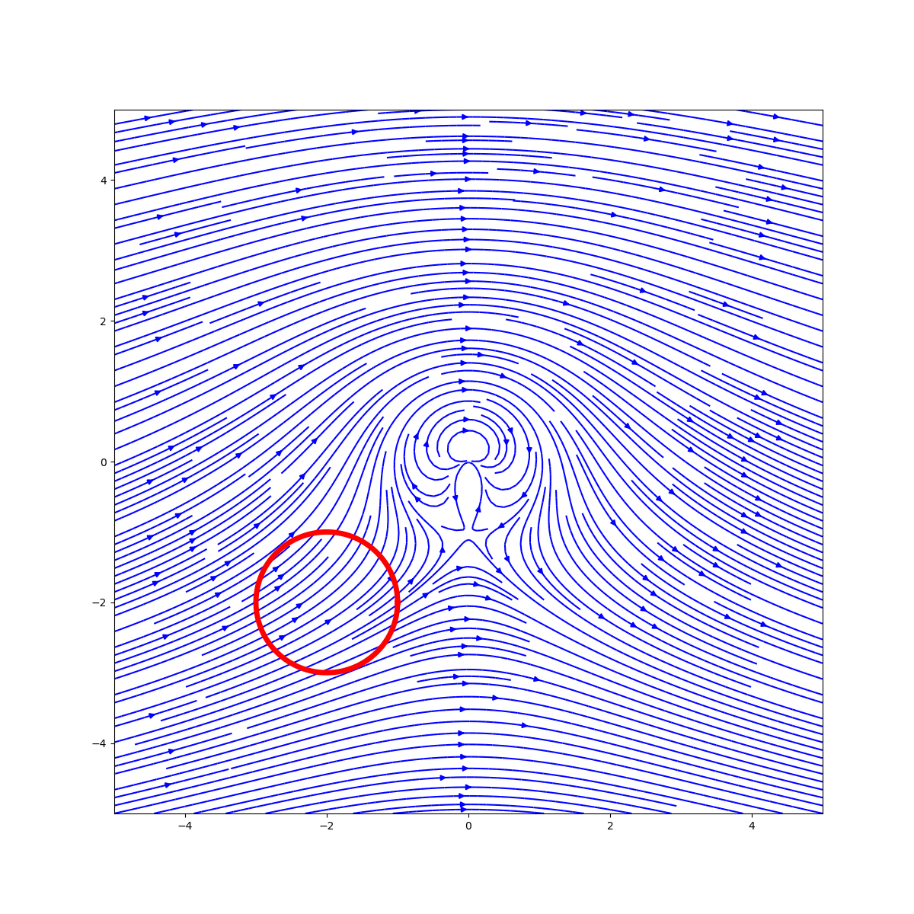
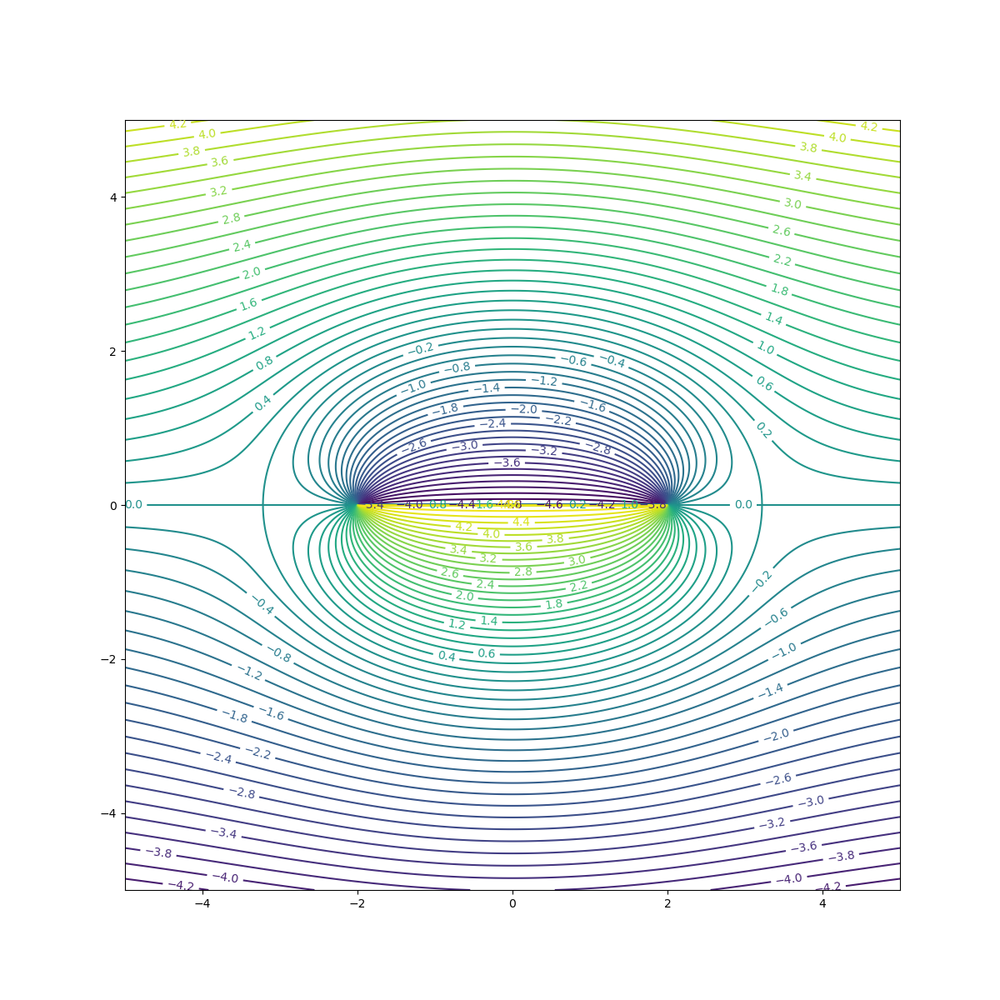
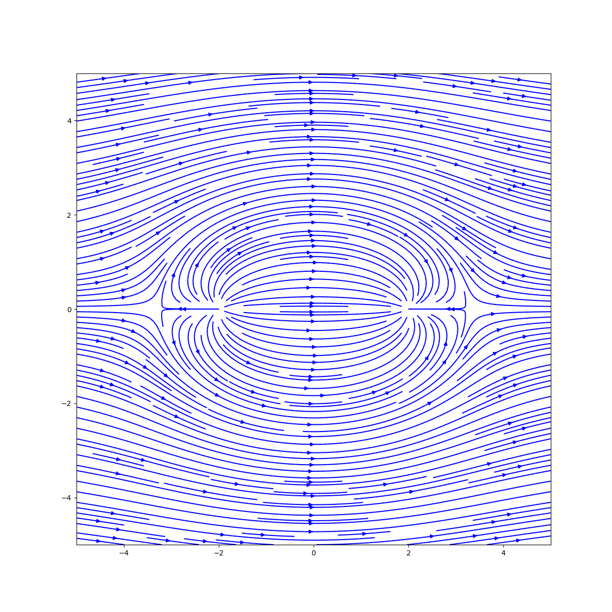
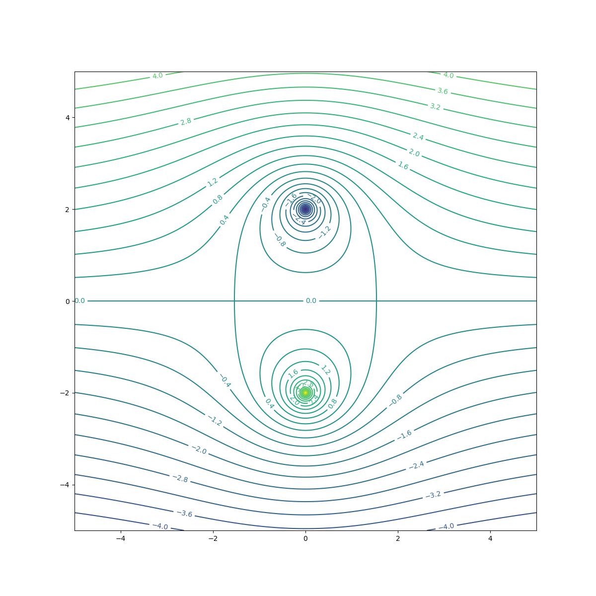
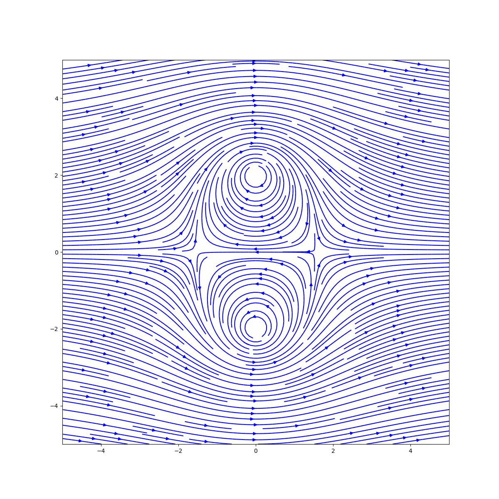

## Acknowledgements
Much thanks goes to [JoshTheEngineer](https://www.youtube.com/@JoshTheEngineer). His videos, derivations and code implementations were an invaluable resource for building this project especially the panel methods.

# Potential Flow Visualizer

The first part of this project is a simple potential flow visualizer. The program allows you to experiment with the superposition of different potential flow fields. The program is written in Python using numpy and matplotlib for visualization.

The basic elementary flows provided are:

- Uniform flow
- Source
- Sink
- Vortex
- Doublet

## Usage
These are some constants that provide a default configuration for the plotting. These can be changed as desired. The values are self-explanatory.
Ultimately, the plot function returns a matplotlib figure object so that can be further manipulated to suit your needs.

```python
import numpy as np
from src import elementary_flows
from flow_field import FlowField

form
multiprocessing
import freeze_support

if __name__ == '__main__':
    freeze_support()  # This is required for multiprocessing to work
    NO_OF_POINTS = 1000  # Number of points in the grid. More points means better resolution but slower computation
    X_POS_LIMIT = 5
    Y_POS_LIMIT = 5
    X_NEG_LIMIT = -5
    Y_NEG_LIMIT = -5

    plotting_kwargs = {  # Default values
        'X_NEG_LIMIT': X_NEG_LIMIT,
        'X_POS_LIMIT': X_POS_LIMIT,
        'Y_NEG_LIMIT': Y_NEG_LIMIT,
        'Y_POS_LIMIT': Y_POS_LIMIT,
        'STREAMLINE_DENSITY': 3,
        'STREAMLINE_COLOR': 'b',
        'CONTOR_LEVELS': 500,
        'CONTOR_COLOR': 'k',
        'FIGURE_SIZE': (12, 12),
        'DPI': 100,
        "CONTOUR_LABELS": True
    }
```
## Lifting Flow over a Cylinder
### Initial Configuration
```python
    x = np.linspace(X_NEG_LIMIT, X_POS_LIMIT, num=NO_OF_POINTS) # X and Y coordinates for the grid
    y = np.linspace(Y_NEG_LIMIT, Y_POS_LIMIT, num=NO_OF_POINTS) # Don't worry, Meshgrid is done internally
    
    velocity = 10
    radius = 1
    kappa = 2 * np.pi * velocity * radius ** 2 # Known solution for a cylinder
    vortex_strength = 4 * np.pi * velocity * radius # Known solution for a cylinder
    alpha = np.pi/30 # Angle of attack
```

### Defining the flow field
```python
    u1 = elementary_flows.UniformFlow(horizontal_vel=velocity * np.cos(alpha), vertical_vel=velocity * np.sin(alpha))
    v1 = elementary_flows.Vortex(x_pos=0, y_pos=0, circulation=vortex_strength)
    d1 = elementary_flows.Doublet(x_pos=0, y_pos=0, kappa=kappa)
    
    flow = FlowField([v1, u1, d1], **plotting_kwargs)
    flow.plot_flow_from_stream_function(x, y).show()
    flow.plot_velocity(x, y).show()
```

### Result
### Streamline Contour Plot


### StreamPlot from Velocity


### Calculating circulation
```python
# Add this to imports
from tuple_collections import FlowFieldProperties, Ellipse, EllipseProperties
from circulation import compute_ellipse_and_circulation

if __name__ == '__main__':
    
    # all of the previous code goes here up to the flow definition
    # Create ellipse and compute circulation
    X, Y = np.meshgrid(x, y) # Create meshgrid
    velocity_field = flow.get_velocity(X, Y)
    # Notice x and y are 1D arrays
    flow_properties = FlowFieldProperties(x, y, velocity_field[0], velocity_field[1])
    ellipse = Ellipse(x0=0, y0=0, a=1, b=1)
    ellipse_properties = compute_ellipse_and_circulation(flow_properties, ellipse, divsions=1000)

    # Plot ellipse and circulation
    plt.plot(ellipse_properties.x_cor, ellipse_properties.y_cor, color='r', linewidth=5)
    plt.quiver(ellipse_properties.x_cor, ellipse_properties.y_cor, ellipse_properties.u, ellipse_properties.v,
               color='r', scale=10000)
    plt.show()
    print(f"circulation: {ellipse_properties.circulation}")
```

### Result

#### Ellipse enclosing the vortex


Output:
```text
circulation: 125.66287765465529
```

#### Ellipse not enclosing the vortex

Output:
```text
circulation: -1.9131363160340698e-12
```

## Rankine Oval

```python
plotting_kwargs2 = {
    'CONTOR_LEVELS': 50,
}
v1 = elementary_flows.Source(x_pos=-2, y_pos=0, strength=10)
v2 = elementary_flows.Source(x_pos=2, y_pos=0, strength=-10)# Negative strength is a sink
u1 = elementary_flows.UniformFlow(horizontal_vel=1, vertical_vel=0)

flow = FlowField([v1, v2, u1], **plotting_kwargs2)
flow.plot_flow_from_stream_function(x, y).show()
flow.plot_velocity(x, y).show()
```
### Result
#### Streamline Contour Plot

Streamline Contour Plot


#### StreamPlot from Velocity




## Kelvin's Oval

```python
plotting_kwargs2 = {
    'CONTOR_LEVELS': 50,
}
v1 = elementary_flows.Vortex(x_pos=0, y_pos=2, circulation=10)
v2 = elementary_flows.Vortex(x_pos=0, y_pos=-2, circulation=-10)
u1 = elementary_flows.UniformFlow(horizontal_vel=1, vertical_vel=0)
flow = FlowField([v1, v2, u1], **plotting_kwargs2)
flow.plot_flow_from_stream_function(x, y).show()
flow.plot_velocity(x, y).show()
```

### Result
#### Streamline Contour Plot

#### StreamPlot from Velocity


# Panel Methods
### A Brief Overview
Panel methods are a class of numerical methods used to solve potential flow problems. The idea is to represent the body as a collection of panels. Each of those panels are elementary flows. The flow field is calculated by superimposing the flow fields of each panel. However, to properly model the flow field, the panels must satisfy certain boundary conditions. 

The boundary conditions are:
- The flow velocity normal to the body must be zero
- The Kutta condition must be satisfied

With these boundary conditions, the strengths of each panel can be calculated.

## Usage
THe first thing you is setup the geometry of the body. How you intend to do this is up to you, but you must provide a numpy array of x and y coordinates.


For the rest of this demontration, a NACA 2412 airfoil at an angle of attack of 6 degrees is used. The airfoil was first generated using XFOIL and later using the 'generate_four_digit_NACA' function in [`airfoil_generator.py`](src/useful/airfoil_generator.py).

```python 

import numpy as np
import src.code_collections.data_collections as dc
from src.panel_generator import PanelGenerator

XB, YB = np.loadtxt('xfoil_usable/naca2412.txt', unpack=True)
V = 1
AoA = 6
geometry = dc.Geometry(XB, YB, AoA)  # Create a geometry object
panelized_geometry = PanelGenerator.compute_geometric_quantities(geometry)  # Panelize the geometry
x, y = np.linspace(X_NEG_LIMIT, X_POS_LIMIT, num_grid), np.linspace(Y_NEG_LIMIT, Y_POS_LIMIT,
                                                                    num_grid)  # Create a grid
```
This is the bare minimum to get this working.

### Source Panel Method
The elementary flow used is a source. 
The airfoil is modelled as a collection of source panels whose strengths are constant along the panel but vary from panel to panel.
Only the first boundary condition can be solved since there is no circulation. V<sub>n,j</sub> = 0 is the equation solved for all panels.

```python
from src.spm_funcs import run_source_panel_method

V_normal, V_tangential, lam, u, v = run_source_panel_method(panelized_geometry=panelized_geometry, V=V, AoA=AoA,
                                                            x=x, y=y)
```
With this, you are free to do whatever you want with the results. See [`source_panel_methods_Airfoil.py`](examples/spm_Airfoil.py) for an demonstration of how to use the results.

Note: lam is the strength of the source panels. It is a numpy array of length N where N is the number of panels.


### Vortex Panel Method

The elementary flow used is a vortex. 
Here,the airfoil is modelled as a collection of vortex panels whose strengths are constant along the panel but vary from panel to panel. 
Both of the boundary conditions can be satisfied. V<sub>n,j</sub> = 0 is still the equation solved for across all panels but now the Kutta condition can be satisfied.
The Kutta condition is satisfied by replacing an equation in the system of equations with γ(TE) = 0 i.e. γ<sub>1</sub> + γ<sub>N</sub> = 0

As for the code, it is the same as the source panel method except for the function call.

```python
from src.vpm import run_vortex_panel_method

V_normal, V_tangential, gamma, u, v = run_vortex_panel_method(panelized_geometry=panelized_geometry, V=V, AoA=AoA,
                                                              x=x, y=y)
```
See [`vortex_panel_methods_Airfoil.py`](examples/vpm_Airfoil.py) for an demonstration of how to use the results.


Now while the vortex panel method is able to model the lift force, it is not always consistent and highly depends on the discretization of the airfoil. 
Even with a well discretized XFOIL generated airfoil, the C<sub>p</sub> value oscillates slightly.
Now, Watch happens when we generate the same airfoil rather than using an nicer airfoil. I'm not entirely sure why this happens, but it is something to look into further.
```python
from src.airfoil_generator import generate_four_digit_NACA # Add this to imports

    XB, YB = generate_four_digit_NACA(num_NACA=airfoil, num_points=170, chord_length=1) # Replace this line
```


#### With a lower discretization


### Source Vortex Panel Method

The elementary flows used are a source and a vortex. 
Each panel is made up of: 
- A source with a constant strength along the panel that varies from panel to panel.
- A vortex with constant strength along the panel, with the same strength across all panels.

Once again both of the boundary conditions can be satisfied. 
In addition to solving the system of equations for the normal velocity, 
the Kutta condition is satisfied by also solving the equation V<sub>t,1</sub> = -V<sub>t,N</sub> i.e. 
the first and last panel have the same tangential velocities.

The results are much more cleaner and can provide a more consistent picture of the lift force even with a poorly discretized airfoil.

```python
from src.svpm_funcs import run_source_vortex_panel_method

V_normal, V_tangential, lam, gamma, u, v = run_source_vortex_panel_method(panelized_geometry=panelized_geometry,
                                                                          V=V, AoA=AoA, x=x, y=y)
```


#### With a lower discretization


Much better (in terms of consistency) than the vortex panel method.


