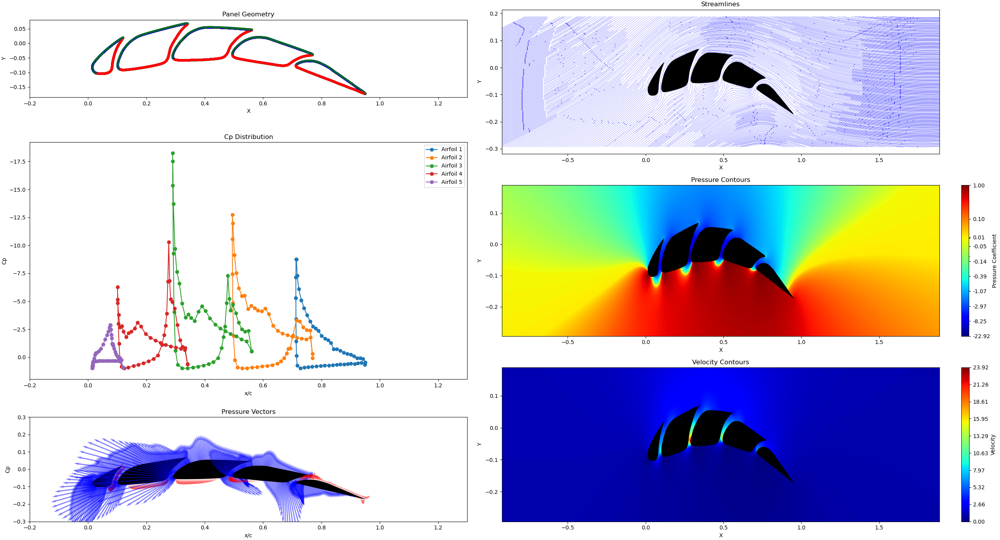
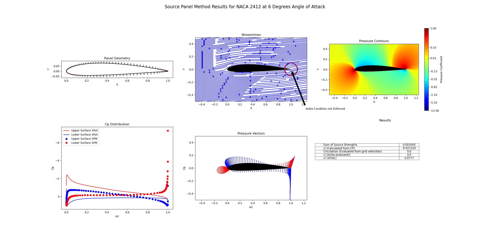
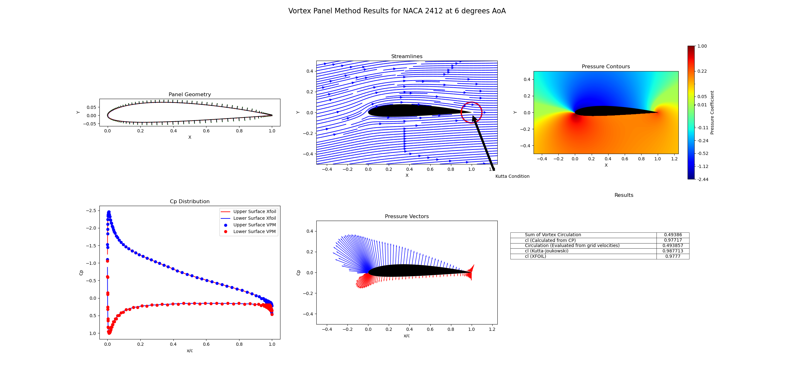
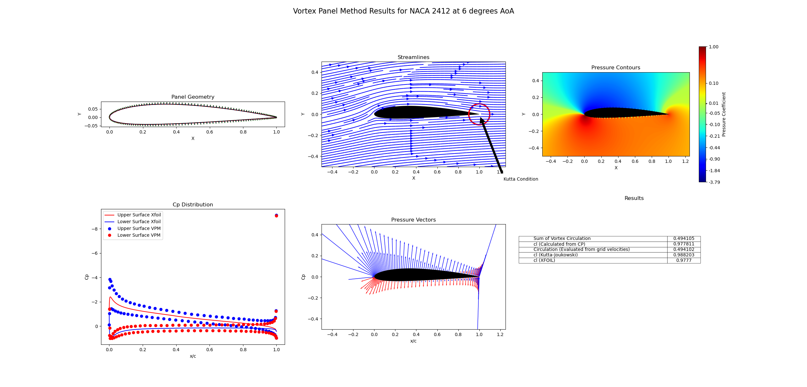
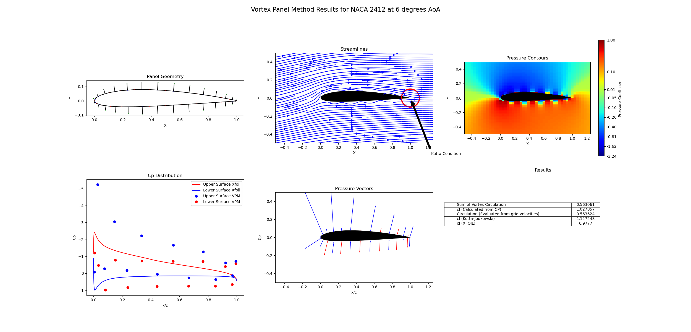
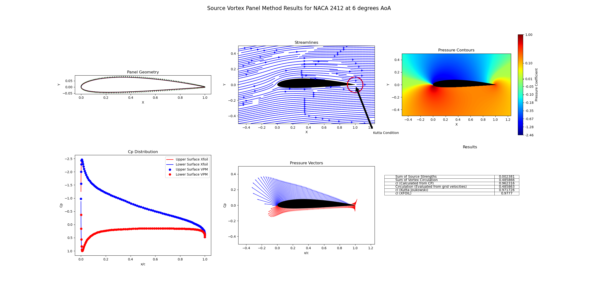
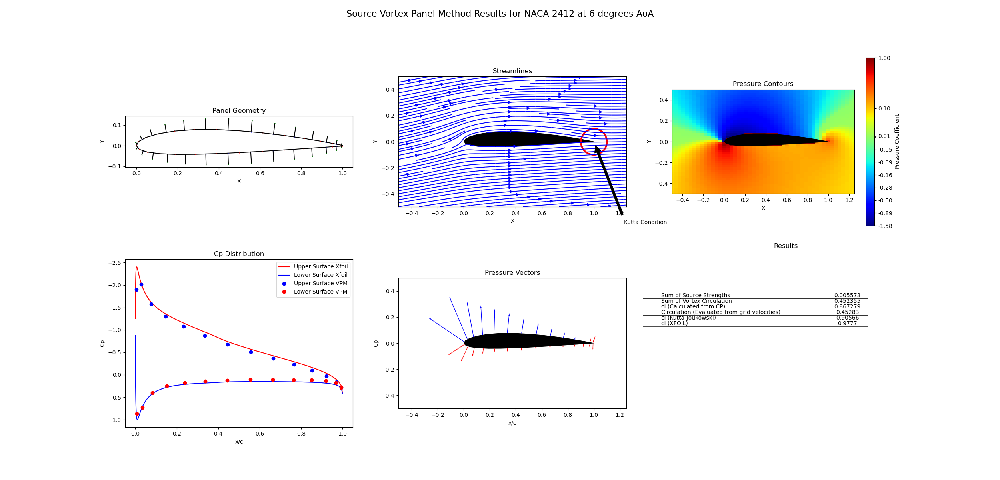
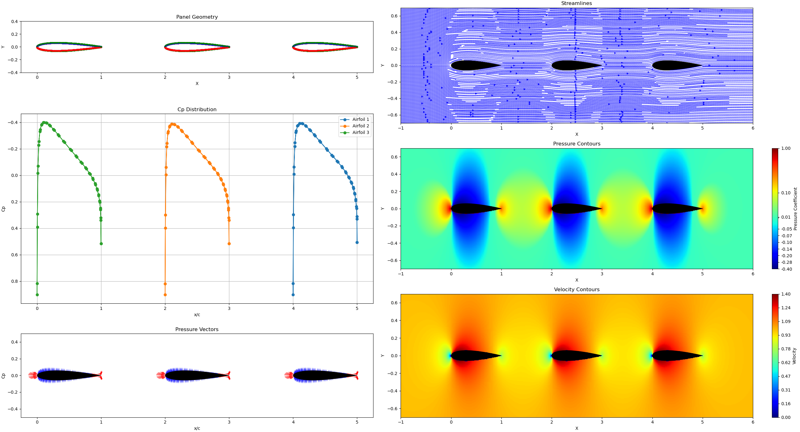

# Introduction

This project is a collection of tools for visualizing and solving potential flow problems.

It provides tools that allows you to do simple things like :

<figure>
    
 <figcaption>Lifting flow over a cylinder at 6 degrees AoA</figcaption>
</figure>

<br>and more complex things like this:


<figure>
    
 <figcaption>Source Vortex Panel Method for Slotted NACA0012 at 8 degrees AoA</figcaption>
</figure>


<br>and... (eventually) do them as fast as possible.

## Acknowledgements
Much thanks goes to [JoshTheEngineer](https://www.youtube.com/@JoshTheEngineer). His videos, derivations and code implementations were an invaluable resource for building and validating this project, especially the panel methods.

# Potential Flow Visualizer

The first part of this project is a simple potential flow visualizer. The program allows you to experiment with the superposition of different potential flow fields. The program is written in Python using numpy and matplotlib for visualization.

The basic elementary flows provided are:

- Uniform flow
- Source
- Sink
- Vortex
- Doublet

## Usage
These are some constants that provide a default configuration for the plotting. These can be changed as desired. The values are self-explanatory.
Ultimately, the plot function returns a matplotlib figure object so that can be further manipulated to suit your needs.

```python

from multiprocessing import freeze_support

if __name__ == '__main__':
    freeze_support()  # This is required for multiprocessing to work. It's very basic for now. Will improve it in the future
    NO_OF_POINTS = 1000  # Number of points in the grid. More points means better resolution but slower computation
    X_POS_LIMIT = 5
    Y_POS_LIMIT = 5
    X_NEG_LIMIT = -5
    Y_NEG_LIMIT = -5

    plotting_kwargs = {  # Default values
        'X_NEG_LIMIT': X_NEG_LIMIT,
        'X_POS_LIMIT': X_POS_LIMIT,
        'Y_NEG_LIMIT': Y_NEG_LIMIT,
        'Y_POS_LIMIT': Y_POS_LIMIT,
        'STREAMLINE_DENSITY': 3,
        'STREAMLINE_COLOR': 'b',
        'CONTOR_LEVELS': 500,
        'CONTOR_COLOR': 'k',
        'FIGURE_SIZE': (12, 12),
        'DPI': 100,
        "CONTOUR_LABELS": True
    }
```
## Lifting Flow over a Cylinder
### Initial Configuration
```python
import numpy as np

    x = np.linspace(X_NEG_LIMIT, X_POS_LIMIT, num=NO_OF_POINTS) # X and Y coordinates for the grid
    y = np.linspace(Y_NEG_LIMIT, Y_POS_LIMIT, num=NO_OF_POINTS) # Don't worry, Meshgrid is done internally
    
    velocity = 10
    radius = 1
    kappa = 2 * np.pi * velocity * radius ** 2 # Known solution for a cylinder
    vortex_strength = 4 * np.pi * velocity * radius # Known solution for a cylinder
    alpha = np.pi/30 # Angle of attack
```

### Defining the flow field
```python
from src.potential_flow import elementary_flows
from src.potential_flow import FlowField

    u1 = elementary_flows.UniformFlow(horizontal_vel=velocity * np.cos(alpha), vertical_vel=velocity * np.sin(alpha))
    v1 = elementary_flows.Vortex(x_pos=0, y_pos=0, circulation=vortex_strength)
    d1 = elementary_flows.Doublet(x_pos=0, y_pos=0, kappa=kappa)
    
    flow = FlowField([v1, u1, d1], **plotting_kwargs)
    flow.plot_flow_from_stream_function(x, y).show()
    flow.plot_velocity(x, y).show()
```

### Result
### Streamline Contour Plot
<figure>
    
 <figcaption>Lifting flow over a cylinder at 6 degrees AoA: Streamline Contours </figcaption>
</figure>


### StreamPlot from Velocity

<figure>
    
 <figcaption>Lifting flow over a cylinder at 6 degrees AoA: Streamplot </figcaption>
</figure>

### Calculating circulation

```python
# Add this to imports
from src.code_collections import FlowFieldProperties, Ellipse
from src.util import compute_ellipse_and_circulation

if __name__ == '__main__':
    # all of the previous code goes here up to the flow definition
    # Set alpha to 0 to get the same plots here

    # Create ellipse and compute circulation
    X, Y = np.meshgrid(x, y)  # Create meshgrid
    velocity_field = flow.get_velocity(X, Y)
    # Notice x and y are 1D arrays
    flow_properties = FlowFieldProperties(x, y, velocity_field[0], velocity_field[1])
    ellipse = Ellipse(x0=0, y0=0, a=1, b=1)
    ellipse_properties = compute_ellipse_and_circulation(flow_properties, ellipse, divsions=1000)

    # Plot ellipse and circulation
    plt.plot(ellipse_properties.x_cor, ellipse_properties.y_cor, color='r', linewidth=5)
    plt.quiver(ellipse_properties.x_cor, ellipse_properties.y_cor, ellipse_properties.u, ellipse_properties.v,
               color='r', scale=10000)
    plt.show()
    print(f"circulation: {ellipse_properties.circulation}")
```

### Result

#### Ellipse enclosing the vortex

<figure>
    
     <figcaption>Lifting flow over a cylinder at 0 degrees AoA: Enclosing the vortex </figcaption>
</figure>

<br>Output:
```text
circulation: 125.66287765465529
```

#### Ellipse not enclosing the vortex
<figure>
    
        <figcaption>Lifting flow over a cylinder at 0 degrees AoA: Not enclosing the vortex </figcaption>
</figure>

<br>Output:
```text
circulation: -1.9131363160340698e-12
```

## Rankine Oval

```python
from src.potential_flow import elementary_flows
from src.potential_flow import FlowField
plotting_kwargs2 = {
    'CONTOR_LEVELS': 50,
}
v1 = elementary_flows.Source(x_pos=-2, y_pos=0, strength=10)
v2 = elementary_flows.Source(x_pos=2, y_pos=0, strength=-10)# Negative strength is a sink
u1 = elementary_flows.UniformFlow(horizontal_vel=1, vertical_vel=0)

flow = FlowField([v1, v2, u1], **plotting_kwargs2)
flow.plot_flow_from_stream_function(x, y).show()
flow.plot_velocity(x, y).show()
```
### Result
#### Streamline Contour Plot

Streamline Contour Plot
<figure>
    
    <figcaption>Rankine Oval: Streamline Contours </figcaption>
</figure>

#### StreamPlot from Velocity

<figure>
    
    <figcaption>Rankine Oval: Streamplot </figcaption>
</figure>


## Kelvin's Oval

```python
from src.potential_flow import elementary_flows
from src.potential_flow import FlowField
plotting_kwargs2 = {
    'CONTOR_LEVELS': 50,
}
v1 = elementary_flows.Vortex(x_pos=0, y_pos=2, circulation=10)
v2 = elementary_flows.Vortex(x_pos=0, y_pos=-2, circulation=-10)
u1 = elementary_flows.UniformFlow(horizontal_vel=1, vertical_vel=0)
flow = FlowField([v1, v2, u1], **plotting_kwargs2)
flow.plot_flow_from_stream_function(x, y).show()
flow.plot_velocity(x, y).show()
```

### Result
#### Streamline Contour Plot

<figure>
    
    <figcaption>Kelvin Oval: Streamline Contours </figcaption>
</figure>

#### StreamPlot from Velocity

<figure>
    
    <figcaption>Kelvin Oval: Streamplot </figcaption>
</figure>


# Panel Methods
### A Brief Overview
Panel methods are a class of numerical methods used to solve potential flow problems. The idea is to represent the body as a collection of panels. Each of those panels are elementary flows. The flow field is calculated by superimposing the flow fields of each panel. However, to properly model the flow field, the panels must satisfy certain boundary conditions. 

The boundary conditions are:
- The flow velocity normal to the body must be zero
- The Kutta condition must be satisfied

With these boundary conditions, the strengths of each panel can be calculated.

## Usage
THe first thing you is setup the geometry of the body. How you intend to do this is up to you, but you must provide a numpy array of x and y coordinates.


For the rest of this demontration, a NACA 2412 airfoil at an angle of attack of 6 degrees is used. The airfoil was first generated using XFOIL and later using the 'generate_four_digit_NACA' function in [`airfoil_generator.py`](src/util/airfoil_generator.py).

```python 

import numpy as np
import src.code_collections.data_collections as dc
from src.util import PanelGenerator  # Anything that does not calculate a panel method almost certainly in here

XB, YB = np.loadtxt('xfoil_usable/naca2412.txt', unpack=True)
V = 1
AoA = 6
geometry = dc.Geometry(XB, YB, AoA)  # Create a geometry object
panelized_geometry = PanelGenerator.compute_geometric_quantities(geometry)  # Panelize the geometry
x, y = np.linspace(X_NEG_LIMIT, X_POS_LIMIT, num_grid), np.linspace(Y_NEG_LIMIT, Y_POS_LIMIT,
                                                                    num_grid)  # Create a grid
```
This is the bare minimum to get this working.

### Source Panel Method
The elementary flow used is a source. 
The airfoil is modelled as a collection of source panels whose strengths are constant along the panel but vary from panel to panel.
Only the first boundary condition can be solved since there is no circulation. V<sub>n,j</sub> = 0 is the equation solved for all panels.

```python
from src.panel_methods.spm import run_panel_method

V_normal, V_tangential, lam, u, v = run_panel_method(panelized_geometry=panelized_geometry, V=V, AoA=AoA,
                                                            x=x, y=y)
```
With this, you are free to do whatever you want with the results. See [`spm_Airfoil.py`](examples/spm_Airfoil.py) for an demonstration of how to use the results.

Note: lam is the strength of the source panels. It is a numpy array of length N where N is the number of panels.


<figure>
    
 <figcaption>Source Panel Method for NACA 2412 at 6 degrees AoA</figcaption>
</figure>

### Vortex Panel Method

The elementary flow used is a vortex. 
Here,the airfoil is modelled as a collection of vortex panels whose strengths are constant along the panel but vary from panel to panel. 
Both of the boundary conditions can be satisfied. V<sub>n,j</sub> = 0 is still the equation solved for across all panels but now the Kutta condition can be satisfied.
The Kutta condition is satisfied by replacing an equation in the system of equations with γ(TE) = 0 i.e. γ<sub>1</sub> + γ<sub>N</sub> = 0

As for the code, it is the same as the source panel method except for the function call.

```python
from src.panel_methods.vpm import run_panel_method

V_normal, V_tangential, gamma, u, v = run_panel_method(panelized_geometry=panelized_geometry, V=V, AoA=AoA,
                                                       x=x, y=y)
```
See [`vpm_Airfoil.py`](examples/vpm_Airfoil.py) for an demonstration of how to use the results.

<figure>
    
 <figcaption>Vortex Panel Method for NACA 2412 at 6 degrees AoA</figcaption>
</figure>

<br>Now while the vortex panel method is able to model the lift force, it is not always consistent and highly depends on the discretization of the airfoil. 
Even with a well discretized XFOIL generated airfoil, the C<sub>p</sub> value oscillates slightly.
Now, observe what happens when the same airfoil is generated rather than using an nicer airfoil. This is something to investigate at a later time. Perhaps it's a bug.

```python
from src.util import generate_four_digit_NACA  # Add this to imports

XB, YB = generate_four_digit_NACA(num_NACA=airfoil, num_points=171, chord_length=1)  # Replace this line
```


<figure>
    
 <figcaption>Vortex Panel Method for NACA 2412 at 6 degrees AoA with a generated airfoil</figcaption>
</figure>

<br>Interestingly, the Cl calculated from CP (effectively the grid velocity)  as well as the lift force from the computed gamma values are still consistent.


#### With a lower discretization


<figure>
    
 <figcaption>Vortex Panel Method for NACA 2412 at 6 degrees AoA with a poorly discritized airfoil</figcaption>
</figure>

### Source Vortex Panel Method

The elementary flows used are a source and a vortex. 
Each panel is made up of: 
- A source with a constant strength along the panel that varies from panel to panel.
- A vortex with constant strength along the panel, with the same strength across all panels.

Once again both of the boundary conditions can be satisfied. 
In addition to solving the system of equations for the normal velocity, 
the Kutta condition is satisfied by also solving the equation V<sub>t,1</sub> = -V<sub>t,N</sub> i.e. 
the first and last panel have the same tangential velocities.

The results are much more cleaner and can provide a more consistent picture of the lift force even with a poorly discretized airfoil.

```python
from src.panel_methods.svpm import run_panel_method

V_normal, V_tangential, lam, gamma, u, v = run_panel_method(panelized_geometry=panelized_geometry,
                                                                          V=V, AoA=AoA, x=x, y=y)
```
See [`svpm_Airfoil.py`](examples/svpm_Airfoil.py) for an demonstration of how to use the results.

<figure>
    
 <figcaption>Source Vortex Panel Method for NACA 2412 at 6 degrees AoA</figcaption>
</figure>

#### With a lower discretization

<figure>
    
 <figcaption>Source Vortex Panel Method for NACA 2412 at 6 degrees AoA with a poorly discritized airfoil</figcaption>
</figure>

<br>Much better (in terms of consistency) than the vortex panel method.

## Multi-Element Airfoil

While single airfoils are nice, they can be improved upon by combining multiple airfoils together.
IT can be achieved by combing the different panel geometries into one big geometry object and solve with the source vortex
panel method.

As regard the mathematics, the only differences are:
- V<sub>n,j</sub> = 0 is computed for each airfoil. (n-1 extra terms)
- The Kutta condition is satisfied by solving the equation V<sub>t,1</sub> = -V<sub>t,N</sub> for each airfoil. (n-1 extra equations)
where n is the number of airfoils.


```python
import numpy as np
from src.code_collections.data_collections import MultiElementAirfoil
from src.multi_element_airfoil import create_clean_panelized_geometry
from src.panel_methods.multi_svpm import  run_panel_method
from pathlib import Path

airfoil_directory_path = Path('../Airfoil_DAT_Selig')

X_NEG_LIMIT = -5
Y_NEG_LIMIT = -5
X_POS_LIMIT = 5
Y_POS_LIMIT = 5
num_grid = 100
V = 1
AoA = 0

airfoils = ['0012', '0012', '0012']
load_NACA = [True, True, True]
num_points = np.array([251, 251, 251])
AF_flip = np.array([[1, 1],
                    [1, 1],
                    [1, 1]])
AF_scale = np.array([1, 1, 1])
AF_angle = np.array([0, 0, 0])
AF_offset = np.array([[0, 0],
                      [2, 0],
                      [4, 0]])

num_airfoils = len(airfoils)

"""                  
Individual  All               Total
Geometries  geometries        geometry
In a list   combined          turned into
            into a single     panelized
            geometry object   geometry
"""     
multi_element_airfoil = MultiElementAirfoil(airfoils=airfoils, load_NACA=load_NACA, num_points=num_points,
                                            AF_flip=AF_flip, AF_scale=AF_scale, AF_angle=AF_angle,
                                            AF_offset=AF_offset)

geometries, total_geometry, total_panelized_geometry_nb = create_clean_panelized_geometry(multi_element_airfoil,
                                                                                          airfoil_directory_path, AoA)


x, y = np.linspace(X_NEG_LIMIT, X_POS_LIMIT, num_grid), np.linspace(Y_NEG_LIMIT, Y_POS_LIMIT,
                                                                    num_grid)  # Create grid

V_normal, V_tangential, lam, gamma, u, v = run_panel_method(geometries, total_panelized_geometry_nb,
                                                                               x=x,
                                                                               y=y,
                                                                               num_airfoil=num_airfoils,
                                                                               num_points=num_points,
                                                                               V=V, AoA=AoA, calc_velocities=True,
                                                                               use_memmap=True)
```

Once again, this is the bare minimum to get this working.

See [`svpm_multi_element_airfoil.py`](examples/svpm_multi_element_airfoil.py) for an demonstration the results have been
manipulated.

<figure>
    
 <figcaption>Source Vortex Panel Method for 3 NACA0012 at 0 degrees AoA</figcaption>
</figure>

#### Output
```text
Sum of gamma:  -3.2026532784308526e-15
Sum of lam:  0.007458103858697829
Chord = Total X Length:  5.0
Chord =  Sum of Chords  3.0
CL (Kutta-Joukowski) Unit Chord:   -6.405306556861705e-15
CL (Kutta-Joukowski) Chord = Total X Length:  -1.281061311372341e-15
CL (Kutta-Joukowski) Chord =  Sum of Chords  -2.1351021856205684e-15
Circulation (Evaluated from grid velocities):  3.12944115066216e-15
CL (Calculated from G):  6.25888230132432e-15
```

This, for now, will serve as a reasonable sanity check for the results. Both lambda and gamma are very small, there is no area enclosed Cp graph and the flow field is symmetric about the x-axis.


## Parallel Implementation

To further speed up the computation, a parallel implementation of the source-vortex panel method is provided. This is only available for the multi-element airfoil case. Along side this, a memory map may be used to store the intermediate results.
It is set true by default.
This is becomes useful when calculating large grids. Likely because of the new bottleneck from this, creating more processes than the number of physical cores available seems to provide a notable speedup for exceedingly large grids (although that is well outside scope of this project).

```python
from src.panel_methods.p_multi_svpm import run_panel_method

njobs = 4  # Number of processes to create

V_normal, V_tangential, lam, gamma, u, v = run_panel_method(geometries, total_panelized_geometry,
                                                            x=x,
                                                            y=y,
                                                            num_airfoil=num_airfoils,
                                                            num_points=num_points,
                                                            V=V, AoA=AoA, calc_velocities=True,
                                                            use_memmap=True, num_cores=njobs)
```